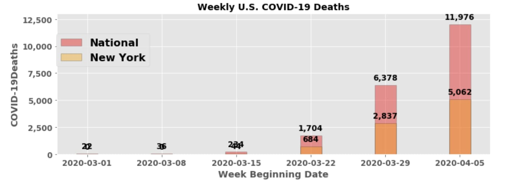
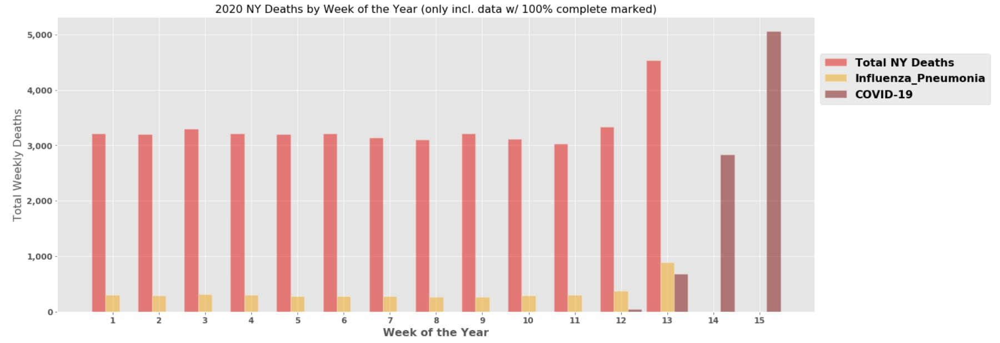

## Using overall Mortality in the U.S. to better understand the COVID-19 reports
One thing I have been struck by during the 20202 global pandemic is the daily reporting on both death and sickness. Death occurs everyday but receiving a daily number has added a certain magnitude and uncertainty. In an attempt to digest the COVID-19 death totals and projections, I looked into some datasets involving overall mortality in the United States. 

*by Jaime DyBuncio*
*4/15/2020*

## Understanding Death relative to the size of the U.S. Population

Using estimates from the U.S. Census, the estimated U.S. Population in 2019 was 328 million which was up 1.6 million from 2018. This net change in population comes from:
* 1.6 million = Births in 2019 - **Deaths in 2019** + Net Migration in 2019
* 1.6 million = 3.8 million - **2.8 million** + 600k

## A glimpse into average weekly U.S. & State Mortality numbers

The closest I could get to daily mortality numbers were reports from the CDC which provide weekly death totals. This dataset is updated every Friday and provides weekly death totals as recently as two weeks ago (more on this later). The CDC aggregates this data by utilizing a surveillance system that receives mortality data from death certificates. Below are some graphs to highlight weekly mortality numbers at both the National and State levels.

    

## Some COVID-19 totals we are familiar with

There are a lot of sources for COVID-19 numbers. The one I used comes from The COVID Tracking Project which tracks local media, data from John’s Hopkins, and other crafty means to get up-to-date data. Since I only have weekly overall mortality numbers, I will also show the COVID-19 data on a weekly basis. As the graph shows below, the week of Apr 5th (last week) was reported to have close to 12k deaths nationally due to COVID-19, with over 5k in New York.

  

## Putting Overall Mortality side-by-side with COVID-19 Deaths

As I mentioned earlier, I only have overall U.S. mortality data from the CDC through two weeks ago. The CDC also includes an estimated % of deaths from Influenza and Pneumonia which I’ll use here. The COVID data I have is updated daily though, so I have those numbers through a longer time period.

Below shows data I have from the CDC combined with the COVID-19 totals I have from The COVID Tracking Project. I specifically focused on New York below since it highlights a trend not seen yet in other states.

  

As you can see above, Week 13, which was three weeks ago, saw a huge rise in overall deaths in New York (+35% from the week prior). This aligns with when NY had their first week with a sizable amount of COVID-19 deaths which also coincides with when NY saw a big jump in Influenza & Pneumonia deaths too.

While we don’t have overall mortality numbers for the most recent two weeks, the amount of COVID-19 deaths has skyrocketed in a staggering manner. Last week’s COVID-19 death total would be the largest amount of weekly Total deaths reported in New York relative to all of 2020’s data and even 2019’s.

## Some Interpretation

One thing occurring in the national narrative is a general questioning of the COVID-19 numbers with some saying they are underreported and others saying they are exaggerated. Politics aside, this exercise in going through these datasets only underlines how reporting on death in a daily manner is not something we have done regularly, nor are equipped to do. This helps to explain the current debate. For example, death data comes from death certificates. Imagine the process to pool all of that data. This is why the CDC’s data is only updated through 2 weeks ago and why it changes even previously reported totals.

Furthermore, add to this the complexity of trying to attribute a death to one cause. The CDC tries to estimate Influenza and Pneumonia deaths by using death codes on death certificates. But, the CDC goes through an extensive process to take apart this data which explains why they don’t publish how many people pass away each flu season until a couple years after-the-fact and why their current numbers are to be used only as a directional guide. In COVID-19’s case, we are trying to report on a daily death number tied to a new virus which has a lack of testing and is more dangerous in those with pre-existing conditions. It is no wonder why the COVID-19 totals are debated and also can be used to serve desired purposes. This gives us reason to look out for overall mortality numbers to get a general high-level sense of if overall mortality is increasing or decreasing in 2020.

## Data Sources
Using data from the CDC, The Covid Tracking Project, and the U.S. Census, this repository creates data pipelines for overall U.S. mortality and investigates relationships with it and COVID and Influenza mortality.

*   CDC Influenza & Pneumonia Sources:
    -   [Data Source](https://gis.cdc.gov/grasp/fluview/mortality.html)
    -   [Methods](https://www.cdc.gov/flu/weekly/overview.htm)
    -   [Home Page](https://www.cdc.gov/flu/weekly/index.htm)

*   COVID-19 Sources:
    -   [Data Source: COVID-19 Tracking Project](https://covidtracking.com/data/us-daily)
    -   [Data Source: CDC COVID-19 Death Data](https://www.cdc.gov/nchs/nvss/vsrr/COVID19/index.htm)
    -   [CDC Home Page](https://www.cdc.gov/coronavirus/2019-ncov/covid-data/covidview.html)

*   Census Population Sources:
    -   [Census Data](https://www.census.gov/data/tables/time-series/demo/popest/2010s-state-total.html)
