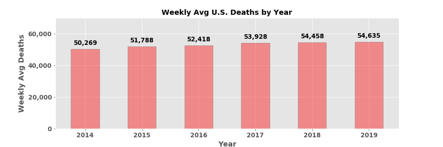
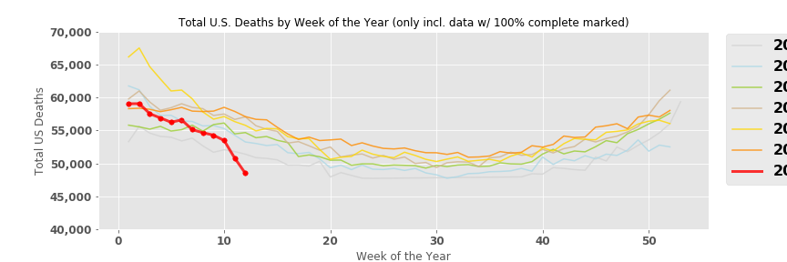
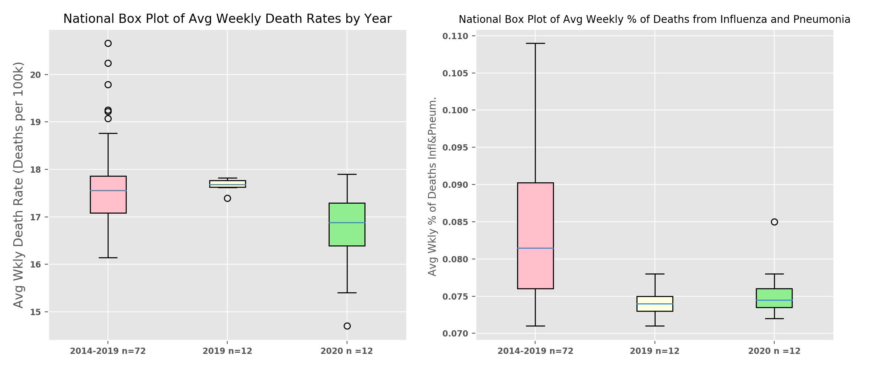

## Using overall United States Mortality to better understand the daily COVID-19 reports
One thing I have been struck by during the 20202 global pandemic is the daily reporting on both death and sickness. Death occurs everyday but receiving a daily number has added a certain magnitude and uncertainty. In an attempt to digest the COVID-19 death totals and projections, I looked into some datasets involving overall mortality in the United States. 

*by Jaime DyBuncio*

## Table of Contents
- [Goals](#goals)
- [Background](#background)
- [Exploratory Data Analysis](#exploratory-data-analysis)
- [Hypothesis Tests](#hypothesis-tests)
- [Conclusion](#conclusion)
- [Data Sources](#data-sources])

## Understanding Death relative to the size of the U.S. Population

Using estimates from the U.S. Census, the estimated U.S. Population in 2019 was 328 million which was up 1.6 million from 2018. This net change in population comes from:
* 1.6 million = Births in 2019 - Deaths in 2019 + Net Migration in 2019
* 1.6 million = 3.8 million - 2.8 million + 600k

## A glimpse into average weekly U.S. & State Mortality numbers

The closest I could get to daily mortality numbers were reports from the CDC which provide weekly death totals. This dataset is updated every Friday and provides weekly death totals as recently as two weeks ago (more on this later). The CDC aggregates this data by utilizing a surveillance system that receives mortality data from death certificates. Below are some graphs to highlight weekly mortality numbers at both the National and State levels.

  

As the graph shows, the United States averaged over 54,000 deaths per week in 2019. This is useful to use as a barometer to the weekly COVID-19 Death totals we have been ingesting on a day-to-day basis. For example, using 2019's deaths per week as a baseline and comparing it to the most recent COVID-19 data:

* Last week (Mar 29 - Apr 4):
    - The U.S. had 6,300+ deaths classified as COVID-19. This represents ~12%+ of Weekly Avg Deaths in 2019. 
    - New York had 2,800+ COVID-19 deaths last week. NY averaged just over 3k deaths per week last yr.
* This week (Apr 5 - Apr 11):
    - The U.S. is trending towards 11,000 deaths due to COVID-19.  This represents ~20%+ of Weekly Avg Deaths in 2019. 
    - New York is trending towards 4,700 COVID-19 deaths this week.

While I would like to look deeper into if the rise in COVID-19 deaths are closely associated with a rise in overall U.S. mortality, the majority of COVID-19 deaths have occurred in the last two weeks and U.S. mortality data is only reliable from 3 weeks ago.  The mortality data I am using comes from the CDC and utilizes a mortality surveillance system led by The National Center for Health Statistics (NCHS) who receives reporting for all deaths in the U.S. from state vital statistics offices. The data comes from death certificates and the deceased are attributed to their state of residence.  Due to the hand-offs in reporting, there is usually a 2-3 week lag, i.e. the most recent data available data is from 2 weeks ago, but applying the CDC's marker of "% Complete", the most recent data which is 100% complete is from 3 weeks ago.

Despite this, a couple things stick out when looking deeper into U.S. mortality data which will be covered in the next section.  Also, the data pipelines created as part of this project will expedite one's ability to look further into the relationship of overall U.S. mortality and COVID-19 deaths in the subsequent weeks when the CDCs data updates to cover the period into April, 2020.

## Some COVID-19 totals we are familiar with

There are a lot of sources for COVID-19 numbers. The one I used comes from The COVID Tracking Project which tracks local media, data from John’s Hopkins, and other crafty means to get up-to-date data. Since I only have weekly overall mortality numbers, I will also show the COVID-19 data on a weekly basis. As the graph shows below, the week of Apr 5th (last week) was reported to have close to 12k deaths nationally due to COVID-19, with over 5k in New York.

## Putting Overall Mortality side-by-side with COVID-19 Deaths

As I mentioned earlier, I only have overall U.S. mortality data from the CDC through two weeks ago. The CDC also includes an estimated % of deaths from Influenza and Pneumonia which I’ll use here. The COVID data I have is updated daily though, so I have those numbers through a longer time period.

Below shows data I have from the CDC combined with the COVID-19 totals I have from The COVID Tracking Project. I specifically focused on New York below since it highlights a trend not seen yet in other states.

As you can see above, Week 13, which was three weeks ago, saw a huge rise in overall deaths in New York (+35% from the week prior). This aligns with when NY had their first week with a sizable amount of COVID-19 deaths which also coincides with when NY saw a big jump in Influenza & Pneumonia deaths too.

While we don’t have overall mortality numbers for the most recent two weeks, the amount of COVID-19 deaths has skyrocketed in a staggering manner. Last week’s COVID-19 death total would be the largest amount of weekly Total deaths reported in New York relative to all of 2020’s data and even 2019’s.

## Some Interpretation

One thing occurring in the national narrative is a general questioning of the COVID-19 numbers with some saying they are underreported and others saying they are exaggerated. Politics aside, this exercise in going through these datasets only underlines how reporting on death in a daily manner is not something we have done regularly, nor are equipped to do. This helps to explain the current debate. For example, death data comes from death certificates. Imagine the process to pool all of that data. This is why the CDC’s data is only updated through 2 weeks ago and why it changes even previously reported totals.

Furthermore, add to this the complexity of trying to attribute a death to one cause. The CDC tries to estimate Influenza and Pneumonia deaths by using death codes on death certificates. But, the CDC goes through an extensive process to take apart this data which explains why they don’t publish how many people pass away each flu season until a couple years after-the-fact and why their current numbers are to be used only as a directional guide. In COVID-19’s case, we are trying to report on a daily death number tied to a new virus which has a lack of testing and is more dangerous in those with pre-existing conditions. It is no wonder why the COVID-19 totals are debated and also can be used to serve desired purposes. This gives us reason to look out for overall mortality numbers to get a general high-level sense of if overall mortality is increasing or decreasing in 2020.

  

The lines above show the Weekly Death Rate (Total Deaths in the U.S. per 100k in population) by week of the year and across years for the deaths occurring in the United States.  There is clear seasonality in our country's death rate, with it peaking at the beginning and the end of each year.

Something sticks out though when observing the Red-Line which represents 2020's data through March 21st. This only uses data from the CDC marked as 100% Complete.  The Red-Line seems to be following a much lower trajectory than that observed in prior years which would be a surprise.  This would suggest that the U.S. Death Rate this year is actually lower than prior years despite the global pandemic.  It should not be left out though that the deaths due to COVID-19 grew dramatically in the past 3 weeks, which is not included in this dataset, but several States were already in lock-down in the last 2-3 data points shown for 2020.  

Not shown on this graph, but also in the CDC data, suggests that despite the appearingly lower Death Rate, the percent of deaths due to Pneumonia and Influenza started to spike in the U.S. in Weeks 12 and 13.  

Therefore, I seek to answer two core questions via Hypothesis Testing in the next section:

1. Is U.S. Weekly Death Rate (Weely Deaths per 100k)  in 2020 lower compared to that in 2019 and in 2014-19? Data allows me to compare through Week 12 (March 21st).

2. Since I also have Flu & Pneumonia data, is the % of  Deaths due to Influenza & Pneumonia in 2020 higher than that seen in 2019 and 2014-19? Data allows me to compare through Week 13 (March 28th) for certain states.

## Hypothesis Tests

The two Hypothesis Tests I ran to answer the two questions stated above are:
- One-Tailed Mann-Whitney Signed Rank Test to compare to see if 2020's Death Rate is lower than prior year through Week 12.
- Two-Tailed Mann-Whitney Signed Rank Test to compare to see if 2020's % of Deaths due to Influenza & Pneumonia is different than prior years through Week 13

The box plots below show the Interquartile ranges for the two respective sample statistics across the year intervals I am comparing against 2020: Avg Weekly Death Rate (per 100k population) & % of Deaths due to Influenza & Pneumonia.

The two Null Hypothesis Tests I set out to perform are:
1. Weekly Death Rate differences 
    - Null Hypothesis: P(Die in a wk in 2019 > Die in a wk in 2020) = 0.50
    - Alternative Hypothesis: P(Die in a wk in 2019 > Die in a wk in 2020) ≠ 0.50
2. % of Deaths due to Influenza & Pneumonia
    - Null Hypothesis: P(Death due to Influenza & Pneumonia in 2020 > Death due to I&P in 2019) = 0.50
    - Alternative Hypothesis: P(Death due to Influenza & Pneumonia in 2020 > Death due to I&P in 2019)  ≠ 0.50

  

  

Through Weeks 1-12 (through Mar 21), 2014-19 and 2019 had higher death rates than 2020 in the U.S. (𝞪 = 0.01), but this does not hold in the 12 States w/ the highest amount of COVID-19 deaths.

Through Weeks 1-13 (through Mar 28), I failed ot reject the null hypothesis that there is any difference in the % of Deaths due to Influenza & Pneumonia at an alpha of 0.10 for all the top 12 States with the highest amount of COVID-19 deaths aside from Florida (NY is close). But, the totals in the past two weeks are peaking and are highlighted by the two outliers seen in New York's graph.

## Conclusion

[
Issues with daily mortality data explain common headlines popping up.  Daily Death #s & Cause are regularly report on. 
- CDC goes back and publishes Deaths due to Influenza in 2 year lookback.
- CDC only recently added COVID death code.
- CDC marks data as 100% complete but it can still change.
- Issues between discerning b/w Pneumonia, Influenza, & COVID-19
- Russia is classifying all Pneumonia deaths as COVID 

Will re-run analysis to keep watchful eye on how 2020’s overall mortality & pneumonia deaths continue to evolve relative to prior years when thinking about COVID-19 totals.

## Data Sources
Using data from the CDC, The Covid Tracking Project, and the U.S. Census, this repository creates data pipelines for overall U.S. mortality and investigates relationships with it and COVID and Influenza mortality.

*   CDC Influenza & Pneumonia Sources:
    -   [Data Source](https://gis.cdc.gov/grasp/fluview/mortality.html)
    -   [Methods](https://www.cdc.gov/flu/weekly/overview.htm)
    -   [Home Page](https://www.cdc.gov/flu/weekly/index.htm)

*   COVID-19 Sources:
    -   [Data Source: COVID-19 Tracking Project](https://covidtracking.com/data/us-daily)
    -   [Data Source: CDC COVID-19 Death Data](https://www.cdc.gov/nchs/nvss/vsrr/COVID19/index.htm)
    -   [CDC Home Page](https://www.cdc.gov/coronavirus/2019-ncov/covid-data/covidview.html)

*   Census Population Sources:
    -   [Census Data](https://www.census.gov/data/tables/time-series/demo/popest/2010s-state-total.html)

*   Supporting Sources
    -   [Where have all the heart attacks gone?](https://www.nytimes.com/2020/04/06/well/live/coronavirus-doctors-hospitals-emergency-care-heart-attack-stroke.html)
    -   [Increases of deaths at home in NYC](https://gothamist.com/news/surge-number-new-yorkers-dying-home-officials-suspect-undercount-covid-19-related-deaths)
    -   [Issues with undercounting/misreporting](https://www.ibtimes.com/coronavirus-usa-death-toll-nears-10000-experts-say-us-undercounting-2953054)
    -   [Issues with undercounting & CDCs lag](https://www.cnn.com/2020/04/06/health/us-coronavirus-death-count-cdc-explainer/index.html)
